<div align="center">


# OpenWorld

**The *PyTorch for code world models*: describe a world, let an LLM write and _verify_ its dynamics as plain Python, and deploy it in one line — no training, no GPU, no dataset.**

[](https://colab.research.google.com/github/quome-cloud/openworld/blob/main/notebooks/quickstart.ipynb)
[](LICENSE)
[](https://www.python.org/)
[](#-design-principles)
[](#-reproducibility--testing)
[](#-empirical-baselines)
[](https://github.com/quome-cloud/openworld/stargazers)
[](#-citation)

<br/>

<a href="#arc3">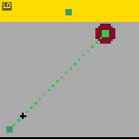</a>

**Source-free, it's the first perfect ARC-AGI-3 result → [25/25 games · 183/183 levels · human-efficient, beats prior SOTA](#arc3).**
Every solve is a *verified, serveable* world model the agent built by acting — the map **is** the model.

**⭐ [Star the repo](https://github.com/quome-cloud/openworld) if this is useful · 📄 [Cite the work](#-citation)**

</div>

> **TL;DR** — A world model in OpenWorld is a small spec: symbolic state + declared
> actions + **verified code dynamics** + an optional **perception** boundary. An LLM can
> *write and verify* that code for you; the result is deterministic, inspectable, and
> needs **0 training data**. Then `openworld serve` turns any spec into a FastAPI
> inference server with a live, animated React Flow view.

> **Who's it for?** Agent & RL researchers who need an *auditable* simulator instead of a
> black box · LLM builders who want a world model as a *verifier / planner* · anyone tired
> of learned dynamics that hallucinate and compound error.

**Prototype a world model in minutes, not months.** The same `World` object you sketch in a
notebook serializes to a portable spec, renders to a model card, composes into bigger
worlds, and deploys as an inference server — one zero-dependency core, no training loop.

---

## ⚡ The 30-second mental model

<div align="center">

</div>

Every world serializes to a **lossless JSON spec** and renders to a **stunning,
self-contained SVG model card** (a HuggingFace-style card — but the artifact is a
*runnable world*). Composition is closed: worlds nest into worlds, coupled by
*bridges* and rolled up by *aggregators*.

<div align="center">
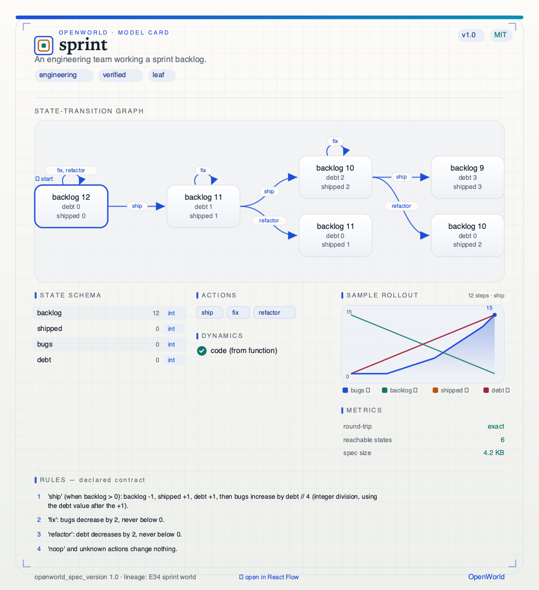
<br/><sub>A generated <b>model card</b> — one self-contained SVG per world: state graph · schema · verified dynamics · rollout · metrics · declared rules. Just <code>render_card(world)</code>.</sub>
</div>

---

<a id="arc3"></a>

## 🎮 Watch it solve ARC-AGI-3 — *source-free, beats prior SOTA*

Each loop is a **verified, source-free solution** to an ARC-AGI-3 game: the agent discovered
the rules *by acting* (no game code), built and verified its own `predict(frame, action)` world
model, reasoned the win condition, and replayed the winning move sequence. **Every solve
round-trips to a serveable OpenWorld `World`** — the map *is* the model. Below: **all 25 public
games**, each completed source-free by **Claude Fable 5**.

<div align="center">
<table>
<tr>
<td align="center">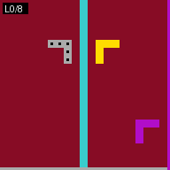<br/><sub><b>ar25</b> · 8/8</sub></td>
<td align="center">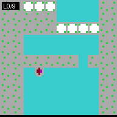<br/><sub><b>bp35</b> · 9/9</sub></td>
<td align="center">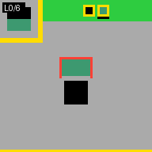<br/><sub><b>cd82</b> · 6/6</sub></td>
<td align="center">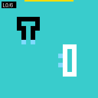<br/><sub><b>cn04</b> · 6/6</sub></td>
<td align="center">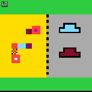<br/><sub><b>dc22</b> · 6/6</sub></td>
</tr>
<tr>
<td align="center">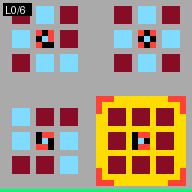<br/><sub><b>ft09</b> · 6/6</sub></td>
<td align="center">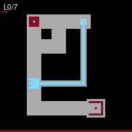<br/><sub><b>g50t</b> · 7/7</sub></td>
<td align="center">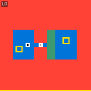<br/><sub><b>ka59</b> · 7/7</sub></td>
<td align="center">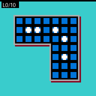<br/><sub><b>lf52</b> · 10/10</sub></td>
<td align="center">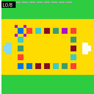<br/><sub><b>lp85</b> · 8/8</sub></td>
</tr>
<tr>
<td align="center">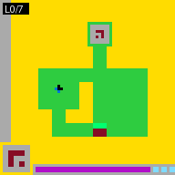<br/><sub><b>ls20</b> · 7/7</sub></td>
<td align="center">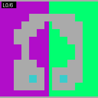<br/><sub><b>m0r0</b> · 6/6</sub></td>
<td align="center">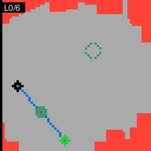<br/><sub><b>r11l</b> · 6/6</sub></td>
<td align="center">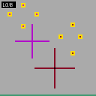<br/><sub><b>re86</b> · 8/8</sub></td>
<td align="center">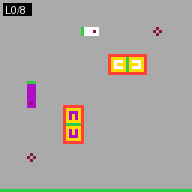<br/><sub><b>s5i5</b> · 8/8</sub></td>
</tr>
<tr>
<td align="center">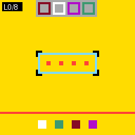<br/><sub><b>sb26</b> · 8/8</sub></td>
<td align="center">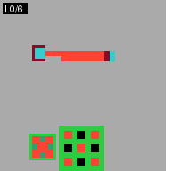<br/><sub><b>sc25</b> · 6/6</sub></td>
<td align="center">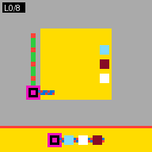<br/><sub><b>sk48</b> · 8/8</sub></td>
<td align="center">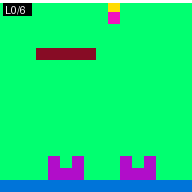<br/><sub><b>sp80</b> · 6/6</sub></td>
<td align="center"><br/><sub><b>su15</b> · 9/9</sub></td>
</tr>
<tr>
<td align="center">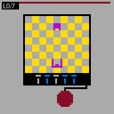<br/><sub><b>tn36</b> · 7/7</sub></td>
<td align="center">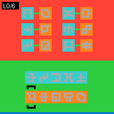<br/><sub><b>tr87</b> · 6/6</sub></td>
<td align="center">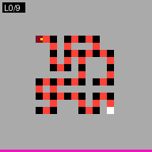<br/><sub><b>tu93</b> · 9/9</sub></td>
<td align="center">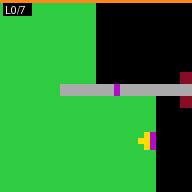<br/><sub><b>vc33</b> · 7/7</sub></td>
<td align="center">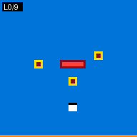<br/><sub><b>wa30</b> · 9/9</sub></td>
</tr>
</table>
</div>

> **Source-free result (audited, replay-verified): all 25/25 games · 183/183 levels — the first
> perfect ARC-AGI-3 result.** With **Claude Fable 5**, every public game is completed source-free and
> human-efficient or better (per-game RHAE 100; per level it beats the human on 174/183 levels) —
> ~72% more action-efficient than the prior SOTA, beating baseline1 (15/25, 145 levels, 58.12 RHAE)
> on games, levels, and, decisively, efficiency. Our primary Claude Opus 4.8 arm reaches 16/25 on the
> identical protocol, so the perfect sweep is a *model-scaling* result. Frames render in the official
> ARC-AGI palette; the label shows the level reached. Full write-up in [`papers/arc-3/`](papers/arc-3/).

---

## 🧠 Why OpenWorld

<div align="center">
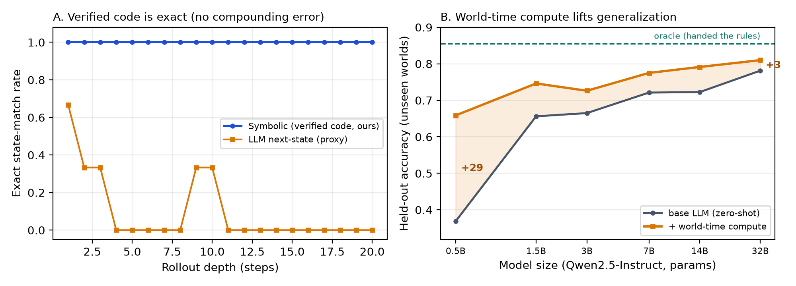
<br/><sub><b>Why code, not weights:</b> verified dynamics are <b>exact at every depth</b> (no compounding error), and <b>world-time compute</b> lifts generalization on unseen worlds — biggest lift where models are smallest.</sub>
</div>

- **Training-free & deterministic.** Dynamics are *synthesized, verified code*, not
  learned latents — no datasets, no GPUs, bit-exact rollouts, **zero compounding
  error**. ([How does it solve tasks with zero data?](docs/how-openworld-solves-with-zero-data.md))
- **Verifiable by construction.** Every candidate dynamics program passes syntax,
  sandboxed smoke-run, invariant, and (optional) LLM-critic gates before it is
  accepted. The accepted code is a plain `.py` you can read, diff, and unit-test.
- **Portable & publishable.** `to_spec(world)` → a complete JSON spec capturing state,
  rules, dynamics, **perception**, **emit**, objectives, metrics, and nested
  composition. `render_card(...)` → one self-contained SVG. `to_mermaid` /
  `to_reactflow` exports included.
- **Composable (worlds-within-worlds).** `CompositeWorld` nests child worlds, couples
  them sideways via `Bridge`s, and rolls them up via `Aggregator`s — recursively.
- **Steerable at inference time.** Objectives are declared scoring functions weighted
  by `Dial`s; move along the Pareto frontier between competing values *without
  retraining*.
- **Deployable in one line.** `openworld serve specs/ --allow-code` →
  `http://127.0.0.1:8080` with `/docs`, batch `/predict`, and a live animated React
  Flow view per world.
- **Local-first & zero-dependency core.** The library talks to [Ollama](https://ollama.com)
  through the standard library; `MockLLM` runs everything fully offline.

---

## 🧭 Three ways to use a world model — pick your path

A verified world model is a reusable artifact, and it is useful **whether or not you ever fine-tune**. There are **three routes to spend it**, plus a hybrid that combines them.

<div align="center">

</div>


**Route 1 — Use it as a tool (no training).** Serve the world and call it: plan through it, query exact next-states, or use it as a verifier. Exact, auditable, zero training.
```bash
openworld serve specs/*.json --allow-code --open
#  POST /step  /rollout  /predict  /run    ·    WS /live
```
*Pick this when* you have the world at inference and want exact, auditable answers or planning.

**Route 2 — Distill one world into the model (test-time training).** Generate exactly-labeled trajectories from a single world and QLoRA-fine-tune on them, so that world's skill is amortized into weights (no tool needed at inference). → `experiments/e80_*_ttt.py`
*Pick this when* you want one world's skill baked in for fast, tool-free inference.

**Route 3 — Train across many worlds (*world-time compute*).** Traverse a *family* of verified worlds and fine-tune → generalize to **held-out** worlds you never trained on. → `experiments/e74_scaling.py`, `e76_world_count.py`, `e80_*`
*Pick this when* you want a model that generalizes across a domain, not just one task.

**Hybrid (the powerful one).** Use **Route 1** to *generate* exact trajectories (plan through the tool → verified data), **Route 2/3** to *internalize* them, and **fall back to the tool** for high-stakes queries. The tool bootstraps the data; training amortizes it; the tool stays the exact oracle.

| | exact? | training | tool at inference | generalizes to new worlds |
|---|---|---|---|---|
| **1 · Tool** | ✅ exact | none | yes | n/a (use any world) |
| **2 · Per-world TTT** | approximate | QLoRA, one world | no | within the world |
| **3 · World-time compute** | approximate | QLoRA, many worlds | no | ✅ across the family |
| **Hybrid** | ✅ on fallback | QLoRA | only when unsure | ✅ + exact backstop |

> Decision line: need exactness/audit → **Route 1**; amortize one world → **Route 2**; generalize a family → **Route 3**; best of both → **Hybrid**.

## 📊 Empirical baselines

Verified-code dynamics vs. learned / LLM dynamics on the framework's own benchmark
suite (numbers from the bundled, reproducible experiments — see [`experiments/`](experiments/)).

<div align="center">

<br/><sub>Generated from <code>experiments/results/e36_representations.json</code> by <code>scripts/make_readme_baselines_fig.py</code>. <b>Structure, not scale:</b> verified symbolic composition needs only per-part marginals; monolithic learners need the full joint and never see it.</sub>
</div>

| Approach | Rollout exact-match | Generalization to novel combos | Training data | Determinism |
|---|:--:|:--:|:--:|:--:|
| **OpenWorld (verified code)** | **1.00 → 1.00** | **1.00** | **0 samples** | **bit-exact** |
| LLM next-state predictor | 0.67 → 0.00 ¹ | — | — | non-deterministic |
| Best learned baseline (boosted trees) | — | 0.20 ² | thousands | seed-dependent |
| Monolithic MLP | — | < 0.20 ² | thousands | seed-dependent |

<sub>¹ Per-step exact-match over a rollout (experiment E01): the LLM degrades to 0 as
error compounds; verified code stays exact. ² Exact accuracy on *unseen*
part-combinations at K=5 (E36): composition-symbolic = 1.00 with **zero** training
data; the strongest of 9 learned families reaches ~0.20.</sub>

> **Note:** OpenWorld reports negative and boundary results honestly — e.g. trace
> *induction* hits an identifiability ceiling (E38) and a same-day trading world is
> sub-S&P on a risk-adjusted basis (E50). The value here is *verified dynamics*, not a
> universal win.

---

## 🚀 Install

> **Note:** Source install for now (not yet on PyPI). **Python 3.14 is recommended**
> (faster-CPython + security/stdlib hardening; a `.python-version` pin selects it under
> pyenv), though the code runs on 3.9+. The **core** (`import openworld`) is
> zero-dependency; the `openworld` CLI + server add `fastapi` / `uvicorn` / `click`
> / `rich`.

```bash
git clone https://github.com/quome-cloud/openworld.git
cd openworld
pyenv install 3.14.6 && pyenv local 3.14.6   # optional: pin the recommended Python
pip install -e .                 # core + CLI/server
pip install -e ".[dev]"          # + test tooling
```

Optional — for LLM-synthesized dynamics, run [Ollama](https://ollama.com) locally:

```bash
ollama pull qwen3-coder:30b      # or any code-capable model
```

---

## ✨ Quickstart (runs out of the box — no LLM required)

Define a world, run it deterministically, serialize it, and render its model card:

```python
from openworld import World, Action, CodeTransition, to_spec, render_card

DYNAMICS = """
def transition(state, action):
    s = dict(state)
    if action["name"] == "heat":   s["temp"] += 1
    elif action["name"] == "cool": s["temp"] -= 1
    return s            # 'idle' (and anything else) holds — explicit & verifiable
"""

room = World(
    name="thermostat",
    description="A room with a thermostat tracking a target temperature.",
    initial_state={"temp": 18, "target": 21},
    actions=["heat", "cool", "idle"],
    rules=["'heat' raises temp by 1, 'cool' lowers it by 1, 'idle' holds."],
    transition=CodeTransition(DYNAMICS),       # verified code — not a neural net
)

print(room.transition.step(room.initial_state, Action("heat")))  # {'temp': 19, 'target': 21}
print(to_spec(room)["state_schema"])           # {'temp': 'int', 'target': 'int'}
render_card(room, "thermostat.svg")            # a self-contained SVG model card
```

Then **deploy it** with a live, animated view:

```python
import os
from openworld import spec_to_json, to_spec
os.makedirs("specs", exist_ok=True)
open("specs/thermostat.json", "w").write(spec_to_json(to_spec(room)))
```

```bash
openworld serve specs/ --allow-code            # → http://127.0.0.1:8080
```

Open `http://127.0.0.1:8080/worlds/thermostat/view`, step the world, and watch the
graph update.

---

## 🐳 Deploy with Docker

The repo ships a `Dockerfile` (Python 3.14, non-root, healthchecked) that runs the
inference server with the bundled specs out of the box:

```bash
docker build -t openworld .
docker run --rm -p 8080:8080 openworld                       # serves the bundled specs/
```

Then open `http://localhost:8080/` (interactive `/view` per world, `/docs` for the API).
Serve your own specs by mounting a directory over `/app/specs`:

```bash
docker run --rm -p 8080:8080 -v "$PWD/specs:/app/specs" openworld
```

The image installs only the core + serve/CLI layer (FastAPI / Uvicorn / Click / Rich);
override the default command to run any CLI subcommand, e.g.:

```bash
docker run --rm openworld ls /app/specs
docker run --rm -p 9000:9000 -v "$PWD/specs:/app/specs" \
  openworld serve /app/specs --host 0.0.0.0 --port 9000 --allow-code --no-open
```

---

## 🛠️ Advanced usage

<details>
<summary><b>Compose worlds-within-worlds (bridges + aggregators)</b></summary>

```python
from openworld import CompositeWorld, Bridge, Aggregator, Action, render_card

def total_treated(children):
    return sum(c["treated"] for c in children.values())

network = CompositeWorld(
    name="hospital-network",
    children={"north": triage_world(), "south": triage_world()},    # any Worlds
    bridges=[Bridge(name="transfer", a="north", b="south",
                    transition=CodeTransition(TRANSFER_CODE))],       # sideways coupling
    aggregators=[Aggregator(name="total_treated", fn=total_treated)], # upward roll-up
    default_actions={"north": "treat_critical", "south": "treat_moderate"},
)
network.transition.step(network.initial_state, Action("tick"))       # steps both + bridge + roll-up
render_card(network, "network.svg")                                  # nested "world of worlds" card
```
</details>

<details>
<summary><b>Perception → world → emit (paste text in, get a report out)</b></summary>

```python
from openworld import World, CodeTransition, CodePerceptor, to_spec

w = World(name="intake", description="ticket intake",
          initial_state={"priority": 0, "load": 0, "done": 0}, actions=["work"],
          transition=CodeTransition(WORK_CODE))

# A perceptor whose extraction is *verified code* — runs server-side with no LLM:
w.perceptors = [CodePerceptor(code=PARSE_CODE, produces=["priority", "load"],
                              schema={"priority": (int, (0, 9)), "load": (int, (0, 99))})]
w.emit = [{"modality": "report", "fields": ["priority", "load", "done"],
           "report": "priority {priority}: cleared {done}, {load} remaining"}]

spec = to_spec(w)   # perception + emit travel inside the spec, losslessly
```

Served, this powers the live view: paste `priority: 7` / `load: 4`, watch it
**perceive → traverse the rules → emit a report**, and loop.
</details>

<details>
<summary><b>LLM-synthesized, verified dynamics (the Code World Model loop)</b></summary>

```python
from openworld import World, OllamaLLM

world = World(
    name="orchard", description="Agents share an orchard with limited apples.",
    initial_state={"apples": 10, "harvested": {"alice": 0}},
    actions=["pick", "wait"],
    rules=["'pick' moves one apple to the acting agent; none left → no-op."],
    llm=OllamaLLM(model="qwen3-coder:30b", options={"num_ctx": 8192}),
)
world.compile(invariants=[("apples never negative", lambda s: s["apples"] >= 0)])
# the LLM writes the dynamics; the verifier gates it (AST + sandbox + invariants
# + optional critic) before acceptance. The result is an editable .py artifact.
```
</details>

<details>
<summary><b>Steerable objectives & Pareto sweeps (no retraining)</b></summary>

```python
from openworld import Dial, Objective, Simulation, sweep

morality = Dial("morality", value=0.0)          # λ ∈ [0, 1]
sim = Simulation(world, agents, objectives=[
    Objective("welfare",  fn=welfare,  weight=1.0),
    Objective("fairness", fn=fairness, weight=morality)])

result = sweep(sim, dial="morality", values=[0.0, 0.1, 0.5, 1.0], steps=20, episodes=3)
print(result.table())                            # totals per dial setting
frontier = result.pareto(["welfare", "fairness"])# non-dominated trade-off points
```
</details>

<details>
<summary><b>CLI: build → optimize → deploy</b></summary>

```bash
openworld build "a support-ticket queue you can paste into" --name intake  # Claude Code authors a spec
openworld optimize specs/intake.json --goal "clear high-priority fastest"   # tune toward a goal
openworld ls specs/                                                        # inspect a catalog
openworld card specs/intake.json --open                                    # render the SVG card
openworld serve specs/ --allow-code                                        # FastAPI @ :8080
```
</details>

<details>
<summary><b>Inference-server API (per world)</b></summary>

| Method | Path | Purpose |
|---|---|---|
| `GET` | `/worlds/{name}` · `/spec` · `/state` · `/actions` · `/metrics` | introspection |
| `GET` | `/card.svg` · `/mermaid` · `/reactflow` · `/view` | visualizations |
| `POST` | `/step` | one forward pass: `{state, action}` → `{next_state, changed}` |
| `POST` | `/predict` | **batch** forward pass |
| `POST` | `/rollout` | multi-step trajectory |
| `POST` | `/observe` · `/run` | perception (gated) / full input → perceive → roll → emit |
| `WS` | `/live` | streamed, animated rollout |

Composites, bridges, and perception are served transparently. `--allow-code` gates
dynamics execution (a trust gate for local specs — **not** a sandbox against
adversarial code).
</details>

---

## 📐 Design principles

- **The core is zero-dependency.** `import openworld` and everything it pulls in uses
  only the standard library. The CLI/server are the one batteries-included layer.
- **Honest science.** Experiments are deterministic, self-checking, and report weak or
  negative results plainly. Paper numbers come *only* from
  [`scripts/make_paper_assets.py`](scripts/make_paper_assets.py) reading
  [`experiments/results/`](experiments/results/).
- **Code is the contract.** Accepted dynamics are auditable artifacts, not weights.

---

## 🔬 Reproducibility & testing

```bash
pytest -q                                  # 284 cases (228 test fns x params), deterministic & offline
python experiments/e57_world_specs.py      # e.g. world specs: 5/5 round-trip exact
python scripts/make_paper_assets.py        # regenerate every paper figure/table/number
```

The **62 bundled experiments** are designed for reproducibility: fixed seeds, numpy
baselines, and `assert`ed claims. The accompanying paper compiles end-to-end from the
same results (`cd paper && tectonic main.tex`).

---

## 📚 Citation

If OpenWorld supports your research, please cite it. This **novel framework** for
verified, composable, training-free world models is built for **reproducibility** and
**empirical baselines**.

> Schwoebel, J. (2026). *OpenWorld: A zero-dependency framework for verified symbolic
> world models* (Version 0.3.0) [Computer software]. Quome.
> https://github.com/quome-cloud/openworld

```bibtex
@software{schwoebel_openworld_2026,
  author  = {Schwoebel, Jim},
  title   = {{OpenWorld}: A Zero-Dependency Framework for Verified Symbolic World Models},
  year    = {2026},
  version = {0.3.0},
  url     = {https://github.com/quome-cloud/openworld},
  note    = {Quome}
}
```

> **Note:** A companion paper is in preparation; a `@article` entry with a DOI / arXiv
> identifier will be added here on release. Until then, please use the `@software`
> citation above — no placeholder identifiers are published.

---

## 🤝 Contributing

Contributions are welcome — new world models, experiments, perceptors, or serving
features.

1. Read **[CLAUDE.md](CLAUDE.md)** (working conventions) and **[QUICKSTART.md](QUICKSTART.md)**.
2. Base every branch on `main`; keep the core zero-dependency; add deterministic,
   self-checking tests.
3. Open a PR against `main` with a clear description and a passing `pytest`.

Found a bug or have an idea? Open an [issue](https://github.com/quome-cloud/openworld/issues).

<div align="center">
<a href="https://github.com/quome-cloud/openworld/graphs/contributors">
  
</a>
</div>

---

## 📄 License

Released under the **[MIT License](LICENSE)** — free for commercial and academic use.

<div align="center">
<sub>Built with verified code, not vibes. ⭐ Star the repo if a readable, deployable world model is useful to you.</sub>
</div>
