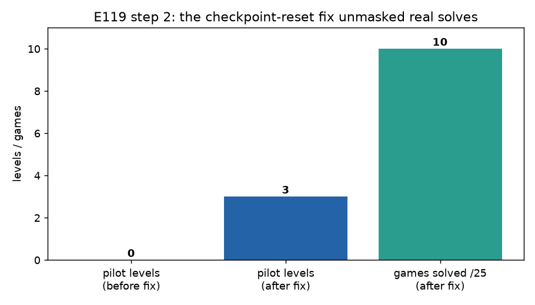
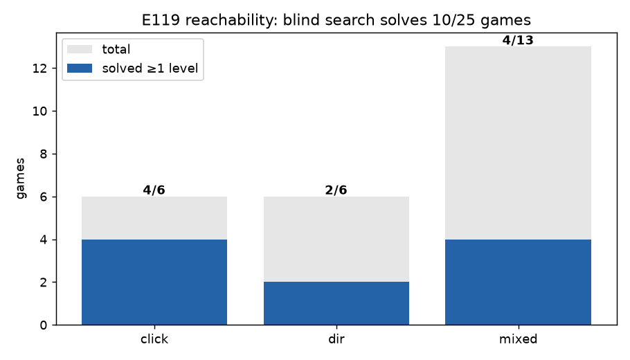
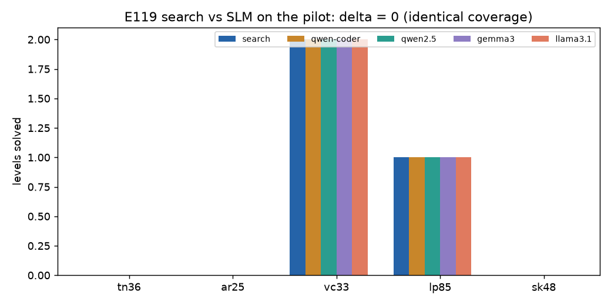
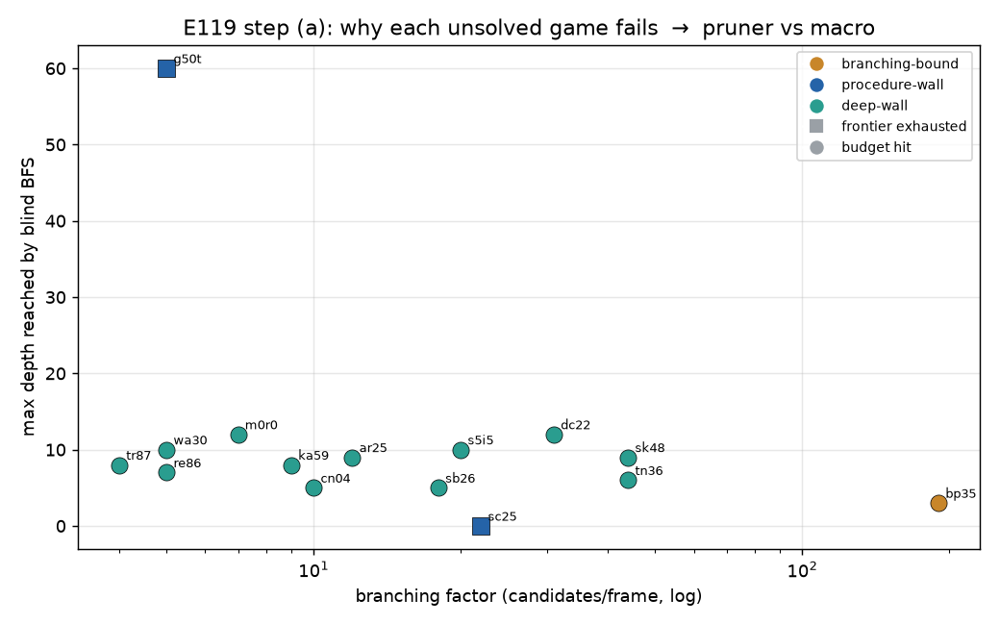

# E119 — progress log (how we improved the experiment)

A chronological lab notebook of every step taken to get E119 from a misleading "0-vs-0 null"
to a measured, root-caused result and a data-driven plan. `STRATEGY.md` = the design;
`RESULTS.md` = the current results snapshot; **this file = the journey and the why.**

All numbers/figures here are regenerated from committed data in `experiments/results/`
(`e119_*.json`) and figures in `experiments/results/e119_figs/`. Nothing is hand-edited.

## Timeline at a glance

| # | Step | What we did | Outcome | Commit |
|---|------|-------------|---------|--------|
| 0 | Setup | Built `.venv` (`arc-agi`+`arcengine` from PyPI, editable `openworld`); fixed local Ollama (Homebrew formula lacked the `llama-server` backend → official app); pulled 4 models | env runs locally, 25 games reachable, 22 unit tests pass | — |
| 1 | Bug #1 | First run crashed on the verification assert; honest zero-solves were flagged "unverified" | `_is_honest()` guard; control baseline survives unsolved games | `dc17a92` |
| 2 | Bug #2 | Search solved levels but they were reported as 0 | root-caused checkpoint-retaining `reset()`; verify on a **fresh** env | `266e6eb` |
| 3 | Reachability | Re-ran control across all 25 games with the fix | **10/25 games solved ≥1 level** | `5af9cf6` |
| 4 | Corrected sweep | search vs 4 SLMs on the pilot, fixed code | **delta = 0**, root-caused | `5af9cf6` |
| 5 | Strategy review | Mapped the SLM-strategies survey onto E119's measured failure | LTS/dense-scoring is the only net-new idea; skip TTT/LoRA | — |
| 6 | Classify (step a) | Diagnosed *why* each of the 15 unsolved games fails | **1 width-bound, 14 walls** → macro is the dominant lever | *(this commit)* |

## Step 1–2 — two bugs were hiding real solves

The first sweep looked like a flat null (every rung 0). Two bugs were responsible:

1. **Honest zero-solve tripped the assert.** `verified = … and reached > 0` marked a legitimate
   0-solve "unverified", so any game the control couldn't crack aborted the whole pilot.
2. **Checkpoint-retaining `reset()` zeroed real solves.** The arc env's `reset()` restores the
   board to the *current level checkpoint* but keeps `levels_completed`. `replay_levels` returns
   a delta `mx − base`; on the reused env `base` was already 1 after a solve, so `1 − 1 = 0`.
   A genuine `ls20`/`vc33`/`lp85` solve was reported as 0. **Fix: verify on a fresh env.**

This second fix is the turning point — it unmasked solves that were there all along:

## Step 3 — reachability: the harness solves 10/25

With correct measurement, blind search + replay-verification (no model) solves **10/25** games:

Solved: `vc33 2/7`, `lp85 1/8`, `r11l 1/6`, `ft09 1/6` (click); `ls20 1/7`, `tu93 1/9` (dir);
`sp80 1/6`, `lf52 1/10`, `su15 1/9`, `cd82 1/6` (mixed). Most cap at level 1; only `vc33` reaches 2.

## Step 4 — search vs SLM: delta = 0 (and why)

All four small models solve **exactly** what blind search solves, per game:

| game | search | qwen-coder | qwen2.5 | gemma3 | llama3.1 |
|------|:---:|:---:|:---:|:---:|:---:|
| vc33 | 2 | 2 | 2 | 2 | 2 |
| lp85 | 1 | 1 | 1 | 1 | 1 |
| tn36/ar25/sk48 | 0 | 0 | 0 | 0 | 0 |
| **total** | **3** | **3** | **3** | **3** | **3** |

Confirms the safety invariant (the model can't make search wrong). The "model speeds up search"
corollary is **not** observed because: the SLM often **abstains**; when it commits, the predicate
is a **binary 0/1** score (no gradient, no pruning); and the reachable pilot levels are **shallow
enough that blind BFS already wins** — no headroom for a prior. *You cannot measure SLM lift on a
game blind search already solves.*

## Step 5 — strategy review (survey doc → E119)

The uploaded SLM-strategies survey targets *static* ARC-AGI-1/2; E119 is *interactive* ARC-AGI-3,
so principles port but most mechanisms don't. Mapping onto the measured failure:

| Survey family | Verdict for E119 |
|---|---|
| **Neural-guided induction — LTS** (execution feedback → dense/pruning signal) | **Adopt** — directly attacks the bottleneck; inference-only |
| **Compensatory: hybrid / tool-delegation / self-scaffolding** | Validates the existing design; merge step-wise scaffolding |
| **RTTC — query-adaptive compute routing** | Generalize the τ-abstain gate to 3-way (search / RAG-predicate / more samples) |
| **TRM — accumulative recursion** | Maybe later (carry consensus across rounds) |
| **TTT/LoRA pillars; SOAR hindsight fine-tuning** | **Skip** — need training infra, wrong (static) setting, against the frozen-model thesis |

Key correction from the data: voting/augmentation reduces *variance*, but our bottleneck is that a
binary predicate gives no *pruning* — voting over 0/1 still yields 0/1. And per E102/103/104 in this
repo, ARC-3 wins are **goal-as-procedure**, not goal-as-state, so even a perfect candidate-pruner
won't crack the wall games — the unused **`macro`** slot (SLM proposes short action sequences) is
the lever that matches the repo's own finding.

## Step 6 (a) — classify the 15 unsolved games: pruner vs macro

Discriminator: when blind BFS fails, did it exhaust the **node budget** (still-unexplored frontier →
*width-limited* → a **pruner** helps) or the **reachable state space** (frontier emptied / stuck,
every short sequence tried, still 0 reward → *procedure-wall* → only a **macro** helps)?

| game | mod | branching | nodes | states | depth | stopped because | class | lever |
|------|-----|:--:|:--:|:--:|:--:|---|---|---|
| bp35 | mixed | **190** | 6004 | 153 | 3 | budget hit | **branching-bound** | **pruner** |
| sc25 | mixed | 22 | 22 | 1 | 0 | frontier empty (all clicks no-op) | procedure-wall | macro/perception |
| g50t | dir | 5 | 4100 | 843 | 60 | frontier empty (depth cap) | procedure-wall | macro |
| tn36 | click | 44 | 6034 | 224 | 6 | budget hit | deep-wall | macro (lean) |
| sk48 | mixed | 44 | 6050 | 154 | 9 | budget hit | deep-wall | macro (lean) |
| s5i5 | click | 20 | 6009 | 387 | 10 | budget hit | deep-wall | macro (lean) |
| dc22 | mixed | 31 | 6014 | 208 | 12 | budget hit | deep-wall | macro (lean) |
| sb26 | mixed | 18 | 6006 | 999 | 5 | budget hit | deep-wall | macro (lean) |
| ar25 | mixed | 12 | 6008 | 609 | 9 | budget hit | deep-wall | macro |
| cn04 | mixed | 10 | 6002 | 1452 | 5 | budget hit | deep-wall | macro |
| ka59 | mixed | 9 | 6000 | 948 | 8 | budget hit | deep-wall | macro |
| m0r0 | mixed | 7 | 6002 | 837 | 12 | budget hit | deep-wall | macro |
| re86 | dir | 5 | 6000 | 2501 | 7 | budget hit | deep-wall | macro |
| wa30 | dir | 5 | 6000 | 2050 | 10 | budget hit | deep-wall | macro |
| tr87 | dir | 4 | 6000 | 3491 | 8 | budget hit | deep-wall | macro |

**Read-out:** only **1/15 (`bp35`)** is genuinely width-strangled (b=190, stuck at depth 3) — the
single clear win for a **pruner**. The other **14/15 are walls**: most have *small* branching yet
explore hundreds-to-thousands of distinct states with **zero reward** (width isn't the constraint),
and two literally exhaust the reachable space (`sc25` — every click is a no-op; `g50t` — all
≤60-step trajectories). Pruning cannot conjure a reward that forward state-search never reaches.

### Data-driven refinement to the plan
The earlier recommendation ordered the levers **(b) pruner → (c) macro**. The classification says
**flip it**: the pruner addresses ~1 game; the **macro/procedure slot addresses ~14**. So the
high-value investment is the **`macro` slot** (SLM proposes short action *procedures* when search
stalls — the design's primary-but-unimplemented slot), with the pruner as a cheap narrow add-on for
high-branching games like `bp35` (and possibly `tn36`/`sk48`). `sc25` additionally flags a
**perception** gap (click candidates are all no-ops there).

## Next steps
1. **Build the `macro` slot** (highest value; addresses 14/15). SLM proposes a short action template
   when search plateaus; replay-verify; on progress, continue. → run **brainstorming** to spec the
   loop hook in `solve.py`, the prompt, and the verification, before any code.
2. **Pruner** as a narrow add-on for high-branching games (`bp35`).
3. Re-measure search-vs-SLM **only on the headroom set** (the 15 unsolved + the open levels of the
   10 partials, e.g. `vc33` 3→7), since solved games show no lift by construction.
4. Revisit `sc25` perception (clicks are no-ops → candidate inference is wrong there).
