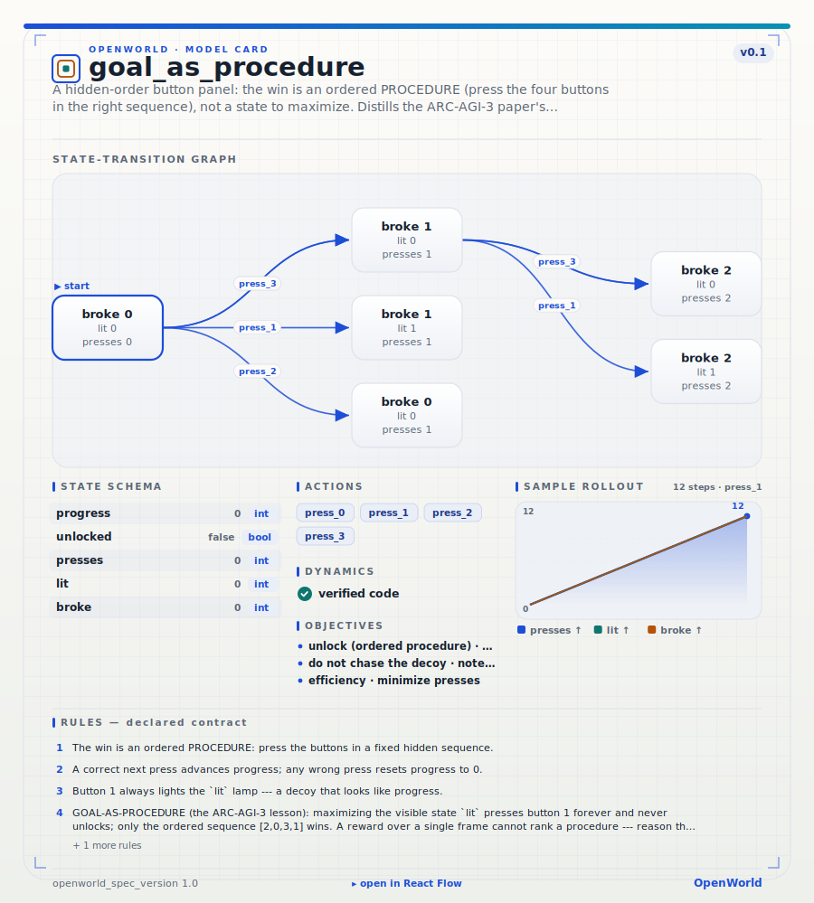
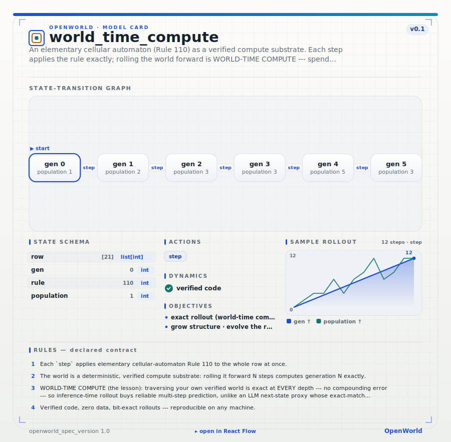

# OpenWorld recipes

A library of **ready-to-run world models**. Each recipe is a portable, lossless
[world-model spec](../openworld/spec.py) — a single JSON file capturing a world's state
schema, concrete initial state, actions, rules, **verified-code dynamics**, objectives, and
(where relevant) perception and emit boundaries. Load one, roll it out, plan in it, or serve
it — no LLM in the loop, bit-exact.

```python
import json
from openworld import from_spec, validate_spec, to_mermaid

spec = json.load(open("recipes/energy/ev_charging.json"))
assert not validate_spec(spec)                 # the publish gate
world = from_spec(spec, allow_code=True)        # a runnable World
print(to_mermaid(spec))                         # the map
```

```bash
openworld serve recipes/**/*.json --allow-code --open   # browse + step them at /view
```

Every recipe's `transition.kind` is `code`: the dynamics are plain, verified Python you can
read, diff, and unit-test — deterministic and reproducible on any machine.

## Domains

| Domain | Recipes | What they model |
|--------|:------:|-----------------|
| [`agentic/`](agentic) | 16 | tool-use, planning, and multi-step agent loops |
| [`cybersecurity/`](cybersecurity) | 17 | incident response, patching, IAM, detection, DDoS |
| [`energy/`](energy) | 16 | grids, EV charging, storage, water/hydrogen allocation |
| [`financial/`](financial) | 17 | underwriting, AML/KYC, settlement, hedging, collections |
| [`healthcare/`](healthcare) | 17 | triage, scheduling, cold-chain, care pathways |
| [`legal/`](legal) | 17 | contracts, discovery, compliance workflows |
| [`interactive-reasoning/`](interactive-reasoning) | 1 | **goal-as-procedure** — from the ARC-AGI-3 paper |
| [`world-time-compute/`](world-time-compute) | 1 | **verified compute substrate** — from the world-time-compute paper |

## Recipes distilled from the papers

The two families below aren't domain scenarios — they are **reusable patterns** lifted from
[`papers/arc-3/`](../papers/arc-3) and [`papers/world-time-compute/`](../papers/world-time-compute),
authored as clean, interpretable worlds you can load, serve, and reuse.
Regenerate both with `python scripts/build_paper_recipes.py`.

Each ships with a **model card** — a self-contained SVG (`<name>.svg`, the "atlas" aesthetic) rendered
by `render_card` next to its spec: the world's state-transition graph, state schema, actions, verified
dynamics, objectives, and rules on one page. (The 25 *real* winning ARC-AGI-3 solves are rendered the
same way in [`papers/arc-3/maps/`](../papers/arc-3/maps) — e.g. `arc3-su15`, the discovered
`start → level 1 → … → win` map of a source-free solve.)

### `interactive-reasoning/goal_as_procedure.json` — the ARC-AGI-3 lesson

A four-button panel with a hidden correct press **order**. The win is an ordered *procedure*
(press the buttons in sequence), **not a state to maximize**: a wrong press resets progress,
and button 1 always lights a shiny `lit` decoy. A method that scores the visible state
(maximize `lit`) presses button 1 forever and never unlocks — only reasoning the sequence wins.

<div align="center">

</div>

> **The transferable lesson (goal-as-procedure).** An interactive-reasoning win is an ordered
> protocol, so a reward scored over a single state cannot rank it — state-scoring and blind
> search bank zero, even on a perfect model. This is why the ARC-AGI-3 walls fall to *reasoning*,
> not search. Reuse the pattern: put the win in an ordered-protocol transition, not a state score.

**The recipe it comes from** (how every ARC-AGI-3 solve is built, Fig. 2 of the paper):
**①** perceive pixels → a symbolic state · **②** explore by acting to gather `(s, a, s′)` ·
**③** synthesize a `predict(frame, action)` program, kept only if it exact-matches held-out
transitions (gate 1) · **④** reason the win condition into an objective · **⑤** plan through the
verified model "in imagination" · **⑥** verify by replaying on the real engine (gate 2). Each
verified win banks as a serveable OpenWorld `World`.

### `world-time-compute/cellular_automaton.json` — a verified world is an exact compute substrate

An elementary cellular automaton (Rule 110). Each `step` applies the rule exactly; rolling the
world forward N generations **is** the computation.

<div align="center">

</div>

> **The transferable lesson (world-time compute).** Verified code stays **exact at every rollout
> depth** — zero compounding error — where a learned next-state proxy drifts as depth grows. So
> inference-time rollout of your own verified world buys reliable multi-step prediction: spend
> *world-time compute* (traverse the world) instead of trusting a one-shot guess. Reuse the
> pattern anywhere the dynamics are writable as code: build the world, then plan/predict by
> traversing it.

## Adding a recipe

Author a `World` with verified-code dynamics, self-check it, then `to_spec` → `validate_spec` →
write the JSON — see [`build/intake.py`](../build/intake.py) and
[`scripts/build_paper_recipes.py`](../scripts/build_paper_recipes.py) for the pattern. Keep the
round-trip lossless: `from_spec(to_spec(w), allow_code=True)` must reproduce the rollout.
